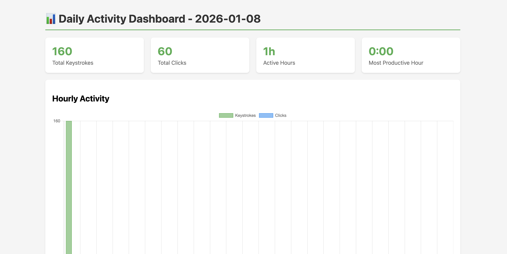

# Activity Tracker

A macOS productivity tool that tracks your keyboard and mouse activity across applications, providing insights into how you spend your time.



## Features

- **Real-time Keystroke Logging** - Captures every keystroke with timestamp and active application
- **Mouse Click Tracking** - Counts mouse clicks throughout the day
- **Per-Application Stats** - See which apps you use most based on actual typing activity
- **Activity Timeline Chart** - Visual area chart showing hourly keystroke activity throughout the day
- **Keystroke Stream Modal** - View your recent keystrokes (up to 500) grouped by application in a popup modal
- **Historical Data Viewing** - Date picker to view activity from any previous day
- **Export to Text** - Export keystrokes as reconstructed readable text, grouped by 30-minute intervals
- **LLM Refined Export** - Use Groq's Llama 3.3 70B to refine exported text into clean, structured format with timestamps and app context
- **Activity Graph Network** - Generate hierarchical activity graphs from refined text, visualizing how daily activities aggregate into broader concepts
- **Interactive Network Graph** - Fullscreen visualization of activity hierarchies with hover tooltips, zoom, and navigation
- **Daily Metrics** - Total keystrokes, clicks, active hours, and peak productivity hour
- **Beautiful Dashboard** - Dark-themed web UI with real-time data visualization

## Requirements

- macOS (uses AppleScript for active window detection)
- Python 3.x
- Accessibility permissions (for keyboard/mouse monitoring)

## Installation

1. Clone the repository:
   ```bash
   git clone <repo-url>
   cd activity-tracker
   ```

2. Create and activate a virtual environment:
   ```bash
   python3 -m venv venv
   source venv/bin/activate
   ```

3. Install dependencies:
   ```bash
   pip install -r requirements.txt
   ```
   
   Or manually:
   ```bash
   pip install Flask pynput pyobjc-framework-Cocoa groq python-dotenv
   ```

4. Set up environment variables (optional, for LLM refinement):
   ```bash
   # Create .env file with your Groq API key
   echo "GROQ_API_KEY=your_api_key_here" > .env
   ```
   Get your API key from [Groq Console](https://console.groq.com/)

5. Grant Accessibility permissions:
   - Go to **System Preferences → Security & Privacy → Privacy → Accessibility**
   - Add your terminal app (Terminal, iTerm, or IDE)

## Usage

### Start the Activity Tracker

```bash
python tracker.py
```

This runs in the background and logs activity to `activity.db` every 60 seconds.

### View the Dashboard

In a separate terminal:

```bash
python webapp.py
```

Open your browser to [http://localhost:5000](http://localhost:5000)

### Activity Graph Page

Navigate to the Activity Graph page from the dashboard header or directly at [http://localhost:5000/activity-graph](http://localhost:5000/activity-graph)

**Features:**
1. **Generate Refined Text** - Create refined keystroke text for a selected date (saved to `data/{date}_refined.txt`)
2. **Generate Activity Graph** - Build a hierarchical network graph of activities (requires refined text first)
3. **View Network Graph** - Interactive fullscreen visualization showing:
   - Layer 1: Individual activities (apps like "Code Editor", "Terminal")
   - Layer 2+: Aggregated concepts (e.g., "software development", "entertainment")
   - Final Layer: Day's overall activity theme
   - Hover tooltips showing full content for each node
   - Click to zoom/focus on nodes
   - Pan and zoom controls

## How It Works

### Data Collection (`tracker.py`)

- Uses `pynput` to listen for keyboard and mouse events
- Detects the active application using AppleScript
- Buffers individual keystrokes with their timestamps and source app
- Every 60 seconds, saves:
  - Individual keystrokes to `keystroke_log` table
  - Aggregated stats per-app to `activity_log` table

### Web Dashboard (`webapp.py`)

- Flask-based web server
- Queries SQLite database for selected date's activity
- Displays:
  - **Metrics cards**: Total keystrokes, clicks, active hours, peak hour
  - **Activity Timeline**: Area chart showing hourly keystroke distribution
  - **Top Apps**: Applications ranked by activity time
  - **Keystroke Stream Modal**: Popup with recent keystrokes grouped by application
- **API Endpoints**:
  - `GET /` - Main dashboard with date parameter support (`?date=YYYY-MM-DD`)
  - `GET /activity-graph` - Activity Graph page for generating refined text and activity graphs (`?date=YYYY-MM-DD`)
  - `GET /api/export-keystrokes?date=YYYY-MM-DD&refine=false` - Export keystrokes as downloadable text file
  - `GET /api/export-keystrokes?date=YYYY-MM-DD&refine=true` - Export keystrokes refined by LLM (requires GROQ_API_KEY in .env)
  - `POST /api/generate-refined-text` - Generate and save refined text to data folder (requires `{"date": "YYYY-MM-DD"}`)
  - `POST /api/generate-activity-graph` - Generate hierarchical activity graph from refined text (requires `{"date": "YYYY-MM-DD"}`)

## Database Schema

### `activity_log`
| Column | Type | Description |
|--------|------|-------------|
| timestamp | DATETIME | When the activity was logged |
| hour | INTEGER | Hour of day (0-23) |
| app_name | TEXT | Application name |
| keystrokes | INTEGER | Number of keystrokes |
| clicks | INTEGER | Number of mouse clicks |

### `keystroke_log`
| Column | Type | Description |
|--------|------|-------------|
| id | INTEGER | Auto-increment ID |
| timestamp | DATETIME | When the key was pressed |
| key_pressed | TEXT | The key that was pressed |
| app_name | TEXT | Active application |

## Project Structure

```
activity-tracker/
├── tracker.py              # Background activity monitor
├── webapp.py               # Flask web dashboard
├── llm_refiner.py          # LLM text refinement pipeline (Groq)
├── activity_network.py     # Activity graph builder (hierarchical concept extraction)
├── requirements.txt        # Python dependencies
├── .env                    # Environment variables (GROQ_API_KEY)
├── activity.db             # SQLite database (auto-created)
├── data/                   # Generated refined text and tree files
│   ├── {date}_refined.txt
│   └── {date}_refined_tree.json
├── templates/
│   ├── dashboard.html      # Main dashboard UI template
│   └── activity_tree.html  # Activity Graph page template
├── assets/
│   └── screenshot.png      # Dashboard screenshot
├── docs/
│   └── architecture.md     # Detailed code documentation
└── venv/                   # Python virtual environment
```

## Documentation

For detailed technical documentation including:
- System architecture diagrams
- Database schema details
- Code flow explanations
- Threading model
- Performance considerations

See [docs/architecture.md](docs/architecture.md)

## Privacy Note

⚠️ This tool logs all keystrokes locally. The data never leaves your machine and is stored in a local SQLite database. Be mindful that sensitive information (passwords, etc.) will be captured. Consider clearing the database periodically or adding exclusion rules for sensitive applications.

## License

MIT

